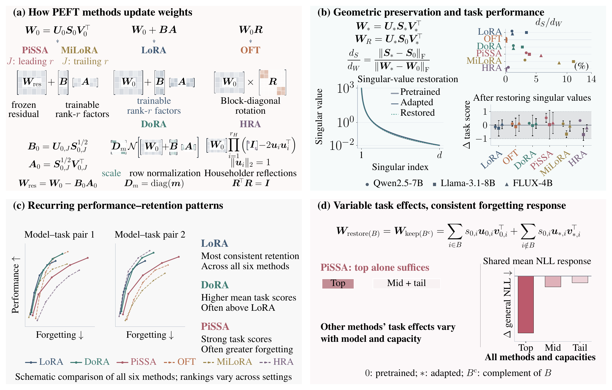
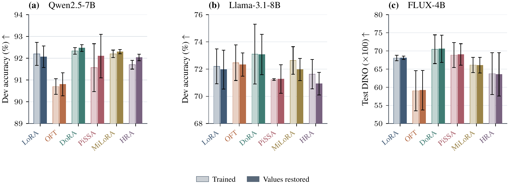
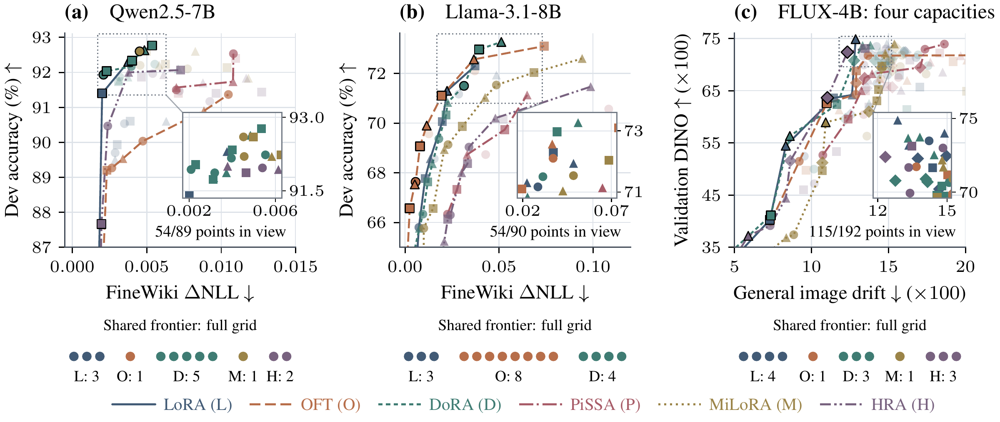
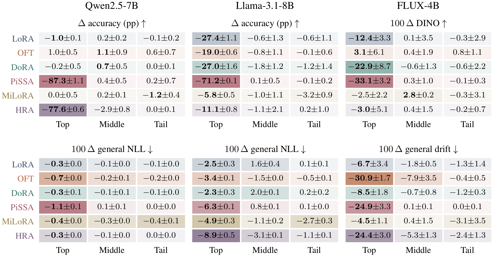

# Are Parameter-Efficient Fine-tuning Methods Really Different?

**When do typical PEFT methods really differ, and which differences matter?**

We compare **LoRA, DoRA, PiSSA, MiLoRA, OFT and HRA** across language and diffusion models, examining task performance, retention of pretrained capabilities and changes in weight geometry under common experimental settings.

[Abstract](#abstract) · [Main findings](#main-findings) · [Quick start](#quick-start) · [Experiment guide](docs/experiments.md) · [Environment and data](docs/environment.md)

## Abstract

Parameter-efficient fine-tuning (PEFT) offers many parameterizations, yet their methodological and functional differences remain unclear. We compare six methods in language and diffusion models to examine how their parameterizations relate to task performance, forgetting, and changes in pretrained weight geometry. Motivated by the spectrum-preserving design of orthogonal fine-tuning (OFT), we first ask whether spectral preservation is itself important for adaptation and retention.

We find that the selected LoRA-family methods also approximately preserve pretrained geometry, and that restoring their slightly drifted singular-value spectra largely preserves task performance, questioning the necessity of explicit geometric preservation. Beyond this, we observe that some methods exhibit distinct adaptation-retention trade-offs that vary across settings. LoRA most consistently limits forgetting at competitive performance, DoRA achieves higher mean task scores than LoRA in most comparisons, while PiSSA often incurs greater retention costs.

Further intervention experiments suggest that while performance gains from different PEFT methods can be attributed to modifications in different groups of spectral components, we consistently find that restoring dominant rather than intermediate or trailing components produces the largest mean reduction in general-text NLL or base-image drift. Together, these results motivate evaluating geometric constraints through their functional consequences rather than preservation alone.



*Study overview. We compare parameterizations, measure geometric changes and intervene on spectral components to test their functional effects. Singular-value decay curves and the performance-retention illustrations are schematic.*

## Main findings

### Task performance largely survives singular-value restoration

Restoring pretrained singular values while retaining the adapted singular vectors largely preserves task performance. In these experiments, tighter geometric preservation alone does not explain which methods adapt well or retain pretrained behavior.



*Pale bars show trained models and saturated bars show restored models at the largest capacities and development-selected or validation-selected learning rates. Error bars show sample standard deviations across seeds. Language panels report development accuracy, and FLUX reports test DINO scores.*

### Similar task scores can conceal different retention costs

After method-specific learning-rate tuning, LoRA most consistently limits forgetting at competitive task performance. DoRA often achieves higher mean task scores with additional forgetting, while PiSSA often has greater retention costs. The trade-offs vary with the model, task and capacity.



*Higher task scores and lower forgetting are better. Language panels use development accuracy and the increase in FineWiki negative log-likelihood (NLL). The image panel uses validation DINO and drift from base-model images. Shapes indicate capacity, lines trace each method's frontier, and black borders mark the shared frontier. Counts below each panel use the full grid, including configurations outside the displayed range.*

### Dominant components show a consistent forgetting response

Restoring dominant pretrained components produces the largest mean reduction in general-text NLL or base-image drift across the tested methods and settings. Its effect on task performance varies substantially, so the spectral changes supporting adaptation need not be the same across methods.



*Top, Middle and Tail denote dominant, intermediate and trailing components ordered by pretrained singular value. Cells show mean changes from trained models plus or minus the sample standard deviation at the largest capacities and selected learning rates. Lower NLL and drift indicate less forgetting. Bold values mark the largest absolute mean change within each row.*

## Experiments

The scripts cover training, development-based learning-rate selection, test evaluation, geometric measurements and interventions. Model experiments use three training seeds per configuration.

| Experiment | Models and data | Methods |
| --- | --- | --- |
| Mathematics | Qwen2.5-7B and Llama-3.1-8B, MetaMath training and GSM8K evaluation | All six |
| Coding | Qwen2.5-7B and Llama-3.1-8B, Python adaptation and HumanEval/MBPP evaluation | All six |
| Cat personalization | FLUX.2-klein-base-4B | All six |
| Object personalization | FLUX.2-klein-base-4B, 28 subjects | LoRA and OFT |
| Geometry and interventions | Language and cat checkpoints, spectral restoration, component interventions and hyperspherical energy | All six |
| Synthetic experiments | Matrix perturbations and singular-vector motion | CPU experiments |

See the [experiment guide](docs/experiments.md) for the exact grids, data preparation, baseline evaluation and analysis commands. The [environment guide](docs/environment.md) covers dependencies and storage.

## Repository contents

| Directory | Contents |
| --- | --- |
| [`scripts/`](scripts/) | Portable launchers for setup, training, selection, evaluation and analysis |
| [`code/`](code/) | Trainers, evaluators, adapter implementations and analysis routines |
| [`data/`](data/) | The frozen 200-document retention sample for language experiments |
| [`docs/`](docs/) | Experiment commands and environment guidance |
| [`assets/`](assets/) | Figures displayed in this README |

## Requirements

Use Linux, Python 3.12 and CUDA GPUs with BF16 support for model experiments. Training uses one GPU per run. The experiments use A100 GPUs. Mathematics interventions require two GPUs, one for analysis and one for vLLM evaluation. Synthetic experiments run on a CPU.

Obtain access to the gated Hugging Face models using your own account. After installing the training environment, authenticate with `.venvs/train/bin/hf auth login`. Coding evaluation also requires Apptainer or Singularity.

## Quick start

Run these commands from the repository root. On a machine with multiple GPUs, expose the intended device with `CUDA_VISIBLE_DEVICES=0`.

```bash
python3 scripts/setup.py train
python3 scripts/setup.py eval
python3 scripts/prepare.py math --model qwen
python3 scripts/prepare.py math --model qwen --stage data

# Train all five learning rates and three seeds for this configuration
python3 scripts/train.py math --model qwen --method lora --level 0 --keep-going
python3 scripts/evaluate_runs.py math dev --model qwen --method lora --level 0
python3 scripts/choose_lr.py math --model qwen --method lora --level 0
python3 scripts/evaluate_runs.py math test
python3 scripts/report.py math
```

See [the experiment guide](docs/experiments.md) for the full grids, coding, images, baselines and interventions. [Environment and data notes](docs/environment.md) describe dependencies and storage.

## Running selected configurations

- Add `--dry-run` to preview commands without downloads or model execution.
- Filter training with `--model`, `--method`, `--level`, `--lr` and `--seed`. Capacity levels start at zero.
- List jobs with `python3 scripts/grid.py math`, then use `--index N` to run an individual configuration.
- Pass the same `--output /path/to/runs` to each stage. The default is `runs/` in the repository. For a custom output directory inside the repository, add that directory to your local Git ignore rules.
- Remove the filters to run the complete grid. LR selection requires all three seeds at a candidate LR and every subject for the object study.

The full grids contain 540 mathematics runs, 180 coding runs, 576 cat runs and 2,016 object runs. The HRA extension adds 18 runs. Selection uses development scores only. Image training records both splits, and selection reads validation scores at step 700. Reports average objects within each seed before computing the mean and sample standard deviation over seeds.

## Synthetic experiments

```bash
python3 scripts/setup.py analysis
python3 scripts/theory.py --plots
```

Plotting requires a complete TeX installation with `latex`, `dvipng` and the Times font packages. Outputs are written under the chosen output directory. Omit `--plots` to run the numerical experiments without TeX.

## Acknowledgments

Our code is based on the [Hugging Face PEFT library](https://github.com/huggingface/peft) and its [MetaMathQA benchmark for LLM mathematics](https://github.com/huggingface/peft/tree/main/method_comparison/MetaMathQA) and [image generation benchmark](https://github.com/huggingface/peft/tree/main/method_comparison/image-gen). We thank the PEFT authors and contributors for these open-source implementations.

Please also credit these upstream projects when building on this code. Source links and attribution are provided in [THIRD_PARTY_NOTICES.md](THIRD_PARTY_NOTICES.md), with references in [CITATION.cff](CITATION.cff). Upstream licenses and copyright notices are retained.
